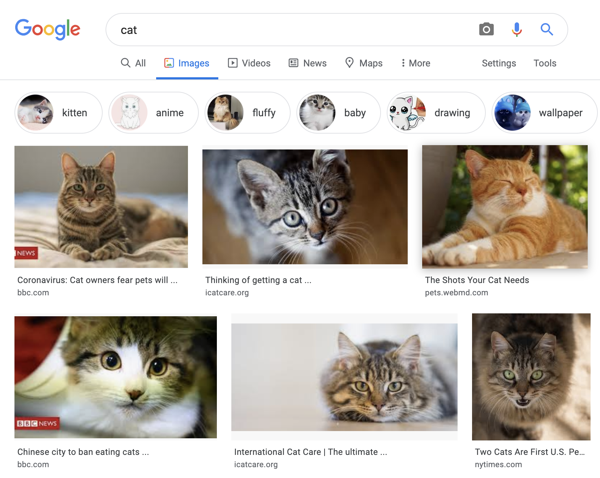
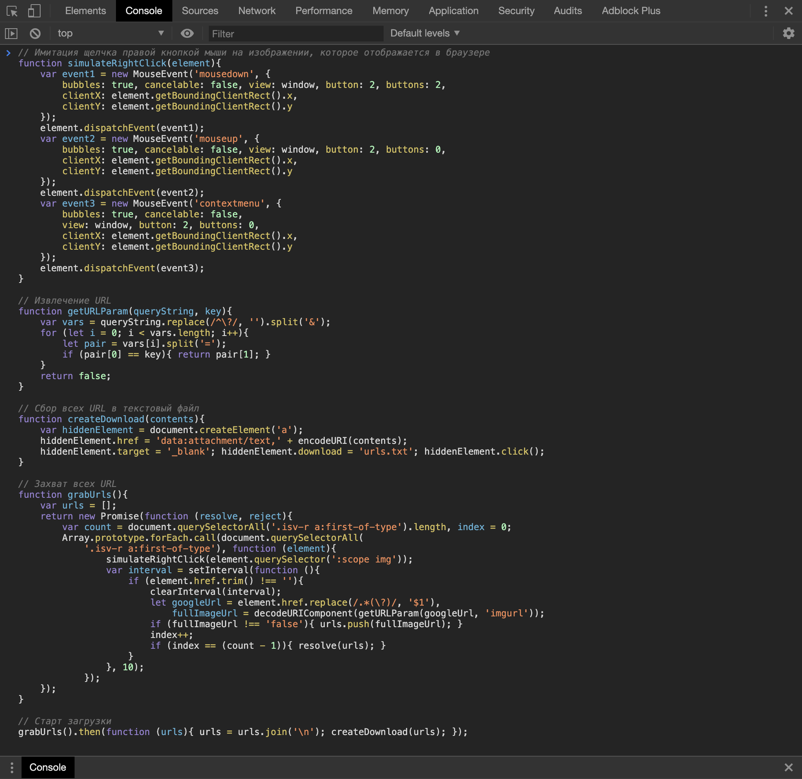
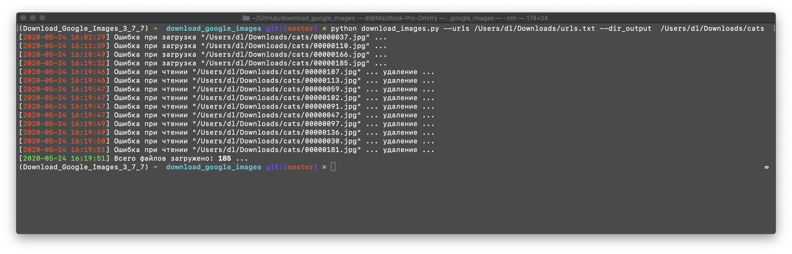

# Массовая загрузка изображений из Google Images

#### `1` Найти необходимые изображения

> При необходимости сделать скроллинг страницы

<h4 align="center"></h4>

#### `2`  Открыть консоль браузера и выполнить код из [console.js](https://github.com/DmitryRyumin/download_google_images/blob/master/console.js)

> Должен быть загружен текстовый файл с URLs всех изображений

<h4 align="center"></h4>

#### `3` Выполнить код из [download_images.py](https://github.com/DmitryRyumin/download_google_images/blob/master/download_images.py)

##### Необходимые зависимости

| Пакеты | Текущая версия |
| ------ | -------------- |
`imutils` |  |
`requests` |  |
`opencv-contrib-python` |  |

<h4 align="center">Пример</h4>

| Файлы/скрипты | Аргументы командной строки | Описания |
| ------------- | -------------------------- | -------- |
| [download_images.py](https://github.com/DmitryRyumin/download_google_images/blob/master/download_images.py) | `--urls str` - Путь к текстовому файлу с URLs изображений `--dir_output str` - Путь к директории, куда будут сохранены изображения | Массовая загрузка изображений из Google Images |

<h4 align="center"></h4>
